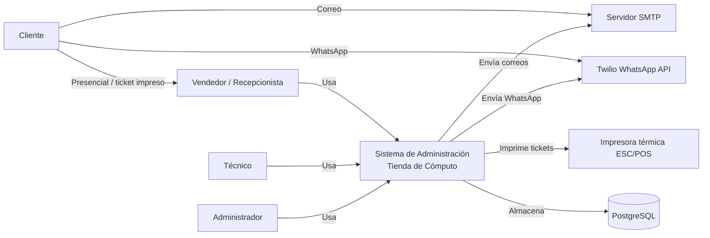
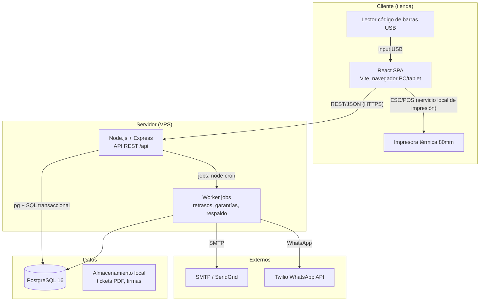
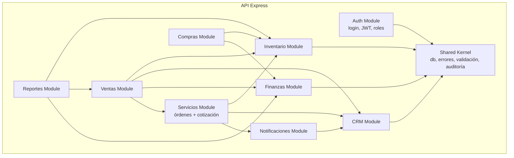

# Arquitectura — Sistema de Administración (Tienda de Cómputo)

> Stack confirmado: React (Vite) + Node/Express + PostgreSQL · Estilo: **Monolito modular** (equipo pequeño, MVP rápido) con API REST consumida por una SPA web.

---

## Nivel 1 — System Context



## Nivel 2 — Containers



## Nivel 3 — Componentes (módulos del backend)



## Dependency Graph

```
[React SPA] ──REST/JSON──► [Express API] ──pg──► [PostgreSQL]
[React SPA] ──REST/JSON──► [Express API] ──► [Worker jobs]
[Worker] ──SMTP──► [Correo] · [Worker] ──Twilio──► [WhatsApp]
```

## Containers (deployable units)

| Container | Tech | Port | Purpose |
|-----------|------|------|---------|
| SPA | React + Vite (estático, servido por nginx) | 80/443 | Punto de venta y gestión en navegador |
| API | Node.js + Express | 3000 (interno) | Lógica de negocio, API REST |
| Worker | Node.js (mismo deploy, procesos separados) | — | Jobs programados: retrasos (cada hora), garantías (diario), respaldo |
| DB | PostgreSQL 16 | 5432 | Persistencia transaccional |
| Print service | node-thermal-printer (proxy local) | 9100 (ESC/POS) | Impresión de tickets desde la SPA |

## Server Modules

| Module | Path | Responsibility | Depends On |
|--------|------|---------------|------------|
| auth | `src/modules/auth/` | login, JWT, refresh, roles | shared |
| inventario | `src/modules/inventory/` | productos, stock, reservas, movimientos, ajustes | shared |
| crm | `src/modules/crm/` | clientes, historial, segmentación, garantías | shared |
| servicios | `src/modules/services/` | órdenes, estados, diagnóstico, cotización, BOM | inventario, crm, notificaciones |
| ventas | `src/modules/sales/` | POS, tickets, descuentos, crédito, devoluciones, cancelaciones | inventario, crm, finanzas, servicios |
| compras | `src/modules/purchases/` | proveedores, órdenes de compra, entradas, CxP | inventario, finanzas |
| finanzas | `src/modules/finance/` | ingresos/egresos, caja, corte/cierre, CxC/CxP | ventas, compras |
| notificaciones | `src/modules/notifications/` | plantillas, envío WhatsApp/correo, historial | crm |
| reportes | `src/modules/reports/` | reportes agregados, exportación Excel/PDF | inventario, ventas, finanzas |
| shared | `src/shared/` | db pool, AppError, validación Zod, auditoría, utilidades | — |

## Client Routes (SPA)

| Route | Layout | User | Components |
|-------|--------|------|------------|
| `/login` | Auth | todos | LoginForm |
| `/` | MainLayout | todos | Dashboard |
| `/venta` | MainLayout | vendedor | SaleScreen (POS) |
| `/venta/:id` | MainLayout | vendedor/admin | TicketView |
| `/clientes` | MainLayout | vendedor/admin | ClientesList → ClienteForm → ClienteDetail |
| `/productos` | MainLayout | vendedor/admin | ProductosList → ProductoForm |
| `/inventario` | MainLayout | admin | InventarioView (ajustes, movimientos) |
| `/ordenes` | MainLayout | vendedor/admin | OrdenesList |
| `/ordenes/nueva` | MainLayout | vendedor | OrdenForm (wizard) |
| `/ordenes/:id` | MainLayout | vendedor/admin | OrdenDetail (diagnóstico, cotización, entrega) |
| `/ordenes/:id/reparacion` | MainLayout | técnico | ReparacionView |
| `/compras` | MainLayout | admin | ComprasView |
| `/caja` | MainLayout | vendedor | CajaView (corte) |
| `/finanzas` | MainLayout | admin | FinanzasView |
| `/reportes` | MainLayout | admin | ReportesView |
| `/notificaciones` | MainLayout | admin | NotifConfigView (plantillas) |
| `/usuarios` | MainLayout | admin | UsuariosView |
| `/configuracion` | MainLayout | admin | ConfigView |

## Data Flow (caso principal: reparación con retraso)

```
1. Vendedor → SPA → POST /api/ordenes → services → db → 201 (folio)
2. Técnico → PUT /api/ordenes/:id/estado (en_diagnostico) → services
3. Técnico → POST /api/ordenes/:id/cotizaciones → services (calcula neto + IVA) → db
4. Vendedor → POST /api/ordenes/:id/cotizaciones/:cid/aprobar → services → inventario (RESERVA) → notificaciones (NOT-03)
5. Técnico → PUT estado en_reparacion → services
6. Técnico → POST /api/ordenes/:id/consumo → services → inventario (SALIDA_CONSUMO, libera reserva)
7. Técnico → PUT estado listo → services → notificaciones (NOT-02 manual)
8. Worker (cada hora) → detecta retraso → marca retrasada → notificaciones (NOT-01 WhatsApp/correo)
9. Vendedor → POST /api/ordenes/:id/entrega → ventas (cobro) → services (entregado) → garantía
```

## State Machine (orden de servicio)

```
pendiente → en_diagnostico → cotizado → en_reparacion → listo → entregado
   │            │              │           │             │
   └──cancelado◄┴──────────────┘           └──cancelado──┘
```

Transiciones válidas y autorización: ver `03-business-rules.md` §4.

## Component Tree (pantalla clave: POS)

```
SaleScreen
├── Sidebar (búsqueda cliente, botones módulos)
├── ProductSearch
│   ├── BarcodeInput (scanner USB)
│   └── ProductResults[]
├── Cart
│   ├── CartItem[] (cantidad, descuento por línea)
│   └── Totals (subtotal, IVA 16%, total)
├── PaymentPanel
│   ├── PaymentMethodSelector
│   ├── CreditCheck (límite cliente)
│   └── ChangeCalculator (efectivo)
└── TicketPreview → PrintService (ESC/POS)
```

## Cross-Cutting Concerns

| Concern | Implementation |
|---------|---------------|
| Auth | JWT Bearer + refresh token; middleware `requireRole('admin'|'vendedor'|'tecnico')` |
| Logging | Structured JSON logger (pino); nivel por entorno |
| Error handling | Middleware global `AppError`; respuesta `{ error: { code, message, details } }` |
| Validation | Zod en el borde del controller (request body/query/params) |
| Auditoría | Tabla `auditoria`; eventos críticos (venta, ajuste, cancelación, cierre de caja, descuento >5%) |
| Transacciones | `pg` + BEGIN/COMMIT/ROLLBACK; reservas y consumos atómicos contra stock |
| Concurrencia | `SELECT ... FOR UPDATE` de líneas de stock al reservar/consumir; bloqueo de sobreventa |

## Riesgos técnicos

| Riesgo | Mitigación |
|--------|------------|
| Sobreveta por concurrencia en POS (dos terminales) | `FOR UPDATE` + restricción `CHECK(stock >= 0)` |
| Worker de retrasos duplicado (dos instancias) | Lock de job con tabla `job_locks` / único worker |
| Impresión térmica inconsistente | Servicio de impresión local aislado; formato ESC/POS estándar 80mm |
| IVA mal calculado en tickets | Centralizar cálculo en shared util `calcMoney(net) → { subtotal, iva, total }`; NUMERIC(19,4) |

## Alternativas consideradas (resumen)

| Alternativa | Por qué no |
|-------------|------------|
| Microservicios por módulo | Equipo pequeño, MVP; más costo operativo del que aporta |
| GraphQL | CRUD simple + reportes; REST es suficiente |
| Frontend SSR (Next.js) | SPA es suficiente; la tienda es intranet con 1-3 terminales |
| Event-driven (RabbitMQ) | Notificaciones cubiertas con worker + hooks de transición; YAGNI |
