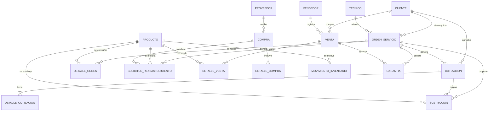
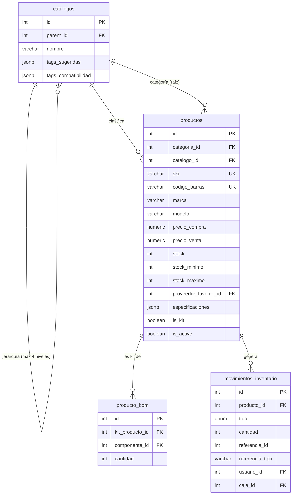
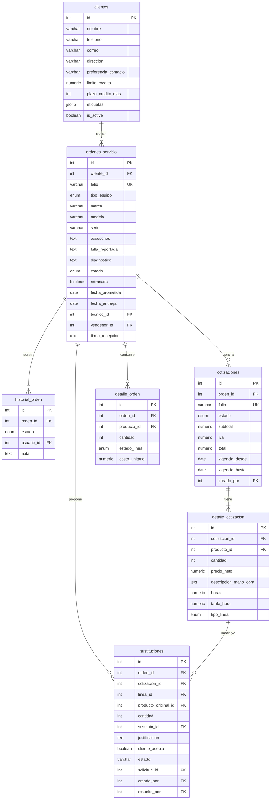
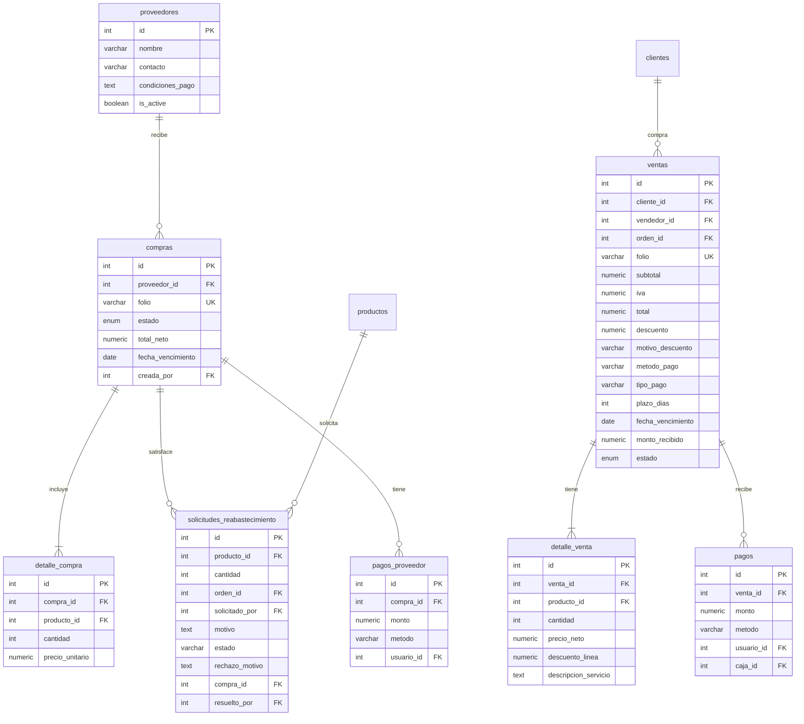
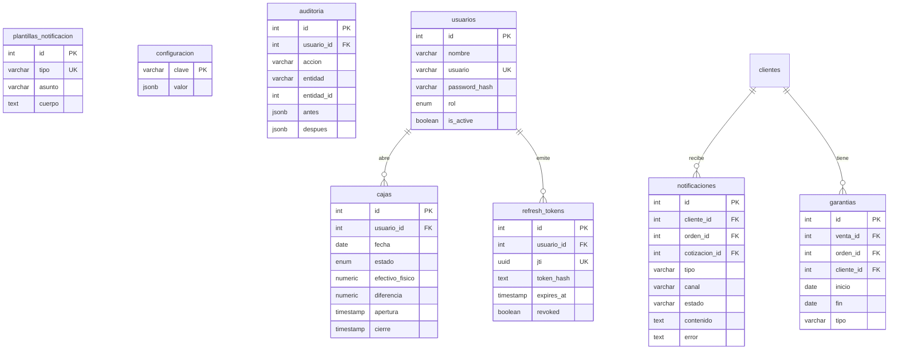

# Modelo de Datos — Sistema de Administración (Tienda de Cómputo)

> Motor: **PostgreSQL 16** · Moneda: `NUMERIC(19,4)` · Timestamps: `TIMESTAMPTZ` · Convención: nombres snake_case, PK `SERIAL` (interna), soft-delete con `is_active`.

---

## 1. Modelo Conceptual (negocio)



## 2. Modelo Lógico — Núcleo: Catálogo e Inventario



## 3. Modelo Lógico — Servicios, Órdenes y Cotizaciones



## 4. Modelo Lógico — Ventas, Compras y Finanzas



## 5. Modelo Lógico — Caja, Notificaciones, Garantías y Configuración



---

## 6. Esquema Físico

### Enums

```
rol:                  admin | vendedor | tecnico
movimiento_tipo:      ENTRADA | SALIDA_VENTA | SALIDA_CONSUMO | AJUSTE | DEVOLUCION | RESERVA | LIBERACION
estado_orden:         pendiente | en_diagnostico | cotizado | en_reparacion | sustitucion_pendiente | listo | entregado | cancelado
estado_linea_orden:   cotizada | reservada | consumida | liberada
estado_cotizacion:    emitida | aprobada | rechazada | expirada | convertida
tipo_linea_cotizacion: refaccion | mano_obra
estado_solicitud:     pendiente | aprobada | entregada | rechazada | cancelada
estado_sustitucion:   pendiente | aceptada | rechazada | cancelada
estado_venta:         completada | cancelada | devuelta | credito_pendiente
tipo_pago:            contado | credito
metodo_pago:          efectivo | tarjeta_credito | tarjeta_debito | transferencia | deposito
estado_compra:        borrador | enviada | recibida | cancelada
estado_caja:          abierta | cerrada | reabierta
estado_notificacion:  enviado | fallido | reintento
tipo_garantia:        producto_nuevo | servicio | usado
preferencia_contacto: whatsapp | correo | llamada
tipo_equipo:          laptop | desktop | all_in_one | periferico | componente | otro
```

> `estado_orden`, `estado_solicitud` y `estado_sustitucion` se modelan como `VARCHAR(20)` en la BD con valores controlados por la API (no como enum de PostgreSQL), salvo `estado_orden` que es `ENUM` (con `sustitucion_pendiente` agregado vía `ALTER TYPE ... ADD VALUE`).

### Tablas

```
TABLE usuarios {
  id              SERIAL PK
  nombre          VARCHAR(120) NOT NULL
  usuario         VARCHAR(60) UNIQUE NOT NULL
  password_hash   TEXT NOT NULL
  rol             rol NOT NULL DEFAULT 'vendedor'
  is_active       BOOLEAN NOT NULL DEFAULT true
  created_at      TIMESTAMPTZ NOT NULL DEFAULT NOW()
  updated_at      TIMESTAMPTZ
}

TABLE refresh_tokens {
  id          SERIAL PK
  usuario_id  INTEGER NOT NULL FK→usuarios.id ON DELETE CASCADE
  jti         UUID NOT NULL UNIQUE
  token_hash  TEXT NOT NULL
  expires_at  TIMESTAMPTZ NOT NULL
  revoked     BOOLEAN NOT NULL DEFAULT false
  created_at  TIMESTAMPTZ NOT NULL DEFAULT NOW()
}

TABLE clientes {
  id                  SERIAL PK
  nombre              VARCHAR(120) NOT NULL
  telefono            VARCHAR(20) NOT NULL
  correo              VARCHAR(120)
  direccion           TEXT
  preferencia_contacto preferencia_contacto NOT NULL DEFAULT 'whatsapp'
  limite_credito      NUMERIC(19,4) NOT NULL DEFAULT 3000 CHECK(limite_credito >= 0)
  plazo_credito_dias  INT NOT NULL DEFAULT 15 CHECK(plazo_credito_dias > 0)
  etiquetas           JSONB NOT NULL DEFAULT '[]'
  is_active           BOOLEAN NOT NULL DEFAULT true
  created_at          TIMESTAMPTZ NOT NULL DEFAULT NOW()
  updated_at          TIMESTAMPTZ
}

TABLE proveedores {
  id              SERIAL PK
  nombre          VARCHAR(120) NOT NULL
  contacto        VARCHAR(120)
  condiciones_pago TEXT
  is_active       BOOLEAN NOT NULL DEFAULT true
  created_at      TIMESTAMPTZ NOT NULL DEFAULT NOW()
  updated_at      TIMESTAMPTZ
}

TABLE catalogos {
  id                  SERIAL PK
  parent_id           INTEGER FK→catalogos.id ON DELETE CASCADE  -- árbol, máx 4 niveles
  nombre              VARCHAR(80) NOT NULL
  tags_sugeridas      JSONB NOT NULL DEFAULT '[]'
  tags_compatibilidad JSONB NOT NULL DEFAULT '[]'
  created_at          TIMESTAMPTZ NOT NULL DEFAULT NOW()
  UNIQUE(parent_id, nombre) WHERE parent_id IS NOT NULL
  UNIQUE(nombre) WHERE parent_id IS NULL
}

TABLE productos {
  id                  SERIAL PK
  categoria_id        INTEGER NOT NULL FK→catalogos.id ON DELETE RESTRICT  -- debe ser raíz (trigger)
  catalogo_id         INTEGER FK→catalogos.id ON DELETE SET NULL
  sku                 VARCHAR(60) UNIQUE NOT NULL
  codigo_barras       VARCHAR(60) UNIQUE
  nombre              VARCHAR(150) NOT NULL
  marca               VARCHAR(80)
  modelo              VARCHAR(80)
  precio_compra       NUMERIC(19,4) NOT NULL CHECK(precio_compra >= 0)
  precio_venta        NUMERIC(19,4) NOT NULL CHECK(precio_venta >= 0)
  stock               INT NOT NULL DEFAULT 0 CHECK(stock >= 0)
  stock_minimo        INT NOT NULL DEFAULT 0 CHECK(stock_minimo >= 0)
  stock_maximo        INT NOT NULL DEFAULT 0 CHECK(stock_maximo >= 0)
  proveedor_favorito_id INTEGER FK→proveedores.id ON DELETE SET NULL
  especificaciones    JSONB NOT NULL DEFAULT '[]'  -- tags del producto (array de strings)
  is_kit              BOOLEAN NOT NULL DEFAULT false
  mano_obra           NUMERIC(19,4) NOT NULL DEFAULT 0 CHECK(mano_obra >= 0)
  is_active           BOOLEAN NOT NULL DEFAULT true
  created_at          TIMESTAMPTZ NOT NULL DEFAULT NOW()
  updated_at          TIMESTAMPTZ
}

-- Trigger: garantiza que productos.categoria_id sea siempre un catálogo raíz
-- (check_categoria_es_raiz → raise si catalogos.parent_id IS NOT NULL).

TABLE producto_bom {
  id              SERIAL PK
  kit_producto_id INTEGER NOT NULL FK→productos.id ON DELETE CASCADE
  componente_id   INTEGER NOT NULL FK→productos.id ON DELETE RESTRICT
  cantidad        INT NOT NULL CHECK(cantidad > 0)
  UNIQUE(kit_producto_id, componente_id)
}

TABLE precio_historial {
  id           SERIAL PK
  producto_id  INTEGER NOT NULL FK→productos.id ON DELETE CASCADE
  precio_compra NUMERIC(19,4) NOT NULL
  precio_venta  NUMERIC(19,4) NOT NULL
  usuario_id   INTEGER NOT NULL FK→usuarios.id ON DELETE RESTRICT
  changed_at   TIMESTAMPTZ NOT NULL DEFAULT NOW()
}

TABLE ordenes_servicio {
  id                SERIAL PK
  cliente_id        INTEGER NOT NULL FK→clientes.id ON DELETE RESTRICT
  folio             VARCHAR(20) UNIQUE NOT NULL
  tipo_equipo       tipo_equipo NOT NULL
  marca             VARCHAR(80)
  modelo            VARCHAR(80)
  serie             VARCHAR(80)
  accesorios        TEXT
  falla_reportada   TEXT NOT NULL
  diagnostico       TEXT
  estado            estado_orden NOT NULL DEFAULT 'pendiente'
  retrasada         BOOLEAN NOT NULL DEFAULT false
  fecha_prometida   DATE NOT NULL
  fecha_entrega     DATE
  tecnico_id        INTEGER FK→usuarios.id ON DELETE SET NULL
  vendedor_id       INTEGER NOT NULL FK→usuarios.id ON DELETE RESTRICT
  firma_recepcion   TEXT -- PNG base64 (captura canvas táctil, SER-10)
  created_at        TIMESTAMPTZ NOT NULL DEFAULT NOW()
  updated_at        TIMESTAMPTZ
}

TABLE historial_orden {
  id           SERIAL PK
  orden_id     INTEGER NOT NULL FK→ordenes_servicio.id ON DELETE CASCADE
  estado       estado_orden NOT NULL
  usuario_id   INTEGER NOT NULL FK→usuarios.id ON DELETE RESTRICT
  nota         TEXT
  created_at   TIMESTAMPTZ NOT NULL DEFAULT NOW()
}

TABLE cotizaciones {
  id            SERIAL PK
  orden_id      INTEGER FK→ordenes_servicio.id ON DELETE CASCADE
  folio         VARCHAR(20) UNIQUE NOT NULL
  estado        estado_cotizacion NOT NULL DEFAULT 'emitida'
  subtotal      NUMERIC(19,4) NOT NULL DEFAULT 0
  iva           NUMERIC(19,4) NOT NULL DEFAULT 0
  total         NUMERIC(19,4) NOT NULL DEFAULT 0
  vigencia_desde DATE NOT NULL
  vigencia_hasta DATE NOT NULL
  creada_por    INTEGER NOT NULL FK→usuarios.id ON DELETE RESTRICT
  created_at    TIMESTAMPTZ NOT NULL DEFAULT NOW()
}

TABLE detalle_cotizacion {
  id                 SERIAL PK
  cotizacion_id      INTEGER NOT NULL FK→cotizaciones.id ON DELETE CASCADE
  tipo_linea         tipo_linea_cotizacion NOT NULL
  producto_id        INTEGER FK→productos.id ON DELETE RESTRICT
  cantidad           INT CHECK(cantidad > 0)
  precio_neto        NUMERIC(19,4) NOT NULL CHECK(precio_neto >= 0)
  descripcion_mano_obra TEXT
  horas              NUMERIC(6,2) CHECK(horas > 0)
  tarifa_hora        NUMERIC(19,4) CHECK(tarifa_hora >= 0)
}

TABLE sustituciones {
  id                   SERIAL PK
  orden_id             INTEGER NOT NULL FK→ordenes_servicio.id ON DELETE CASCADE
  cotizacion_id        INTEGER NOT NULL FK→cotizaciones.id ON DELETE CASCADE
  linea_id             INTEGER NOT NULL FK→detalle_cotizacion.id ON DELETE CASCADE
  producto_original_id INTEGER NOT NULL FK→productos.id
  cantidad             INT NOT NULL CHECK(cantidad > 0)
  sustituto_id         INTEGER NOT NULL FK→productos.id
  justificacion        TEXT
  cliente_acepta       BOOLEAN
  estado               VARCHAR(20) NOT NULL DEFAULT 'pendiente'  -- pendiente|aceptada|rechazada|cancelada
  solicitud_id         INTEGER FK→solicitudes_reabastecimiento.id ON DELETE SET NULL
  creada_por           INTEGER NOT NULL FK→usuarios.id
  resuelto_por         INTEGER FK→usuarios.id
  created_at           TIMESTAMPTZ NOT NULL DEFAULT NOW()
  resuelto_at          TIMESTAMPTZ
}

TABLE detalle_orden {
  id              SERIAL PK
  orden_id        INTEGER NOT NULL FK→ordenes_servicio.id ON DELETE CASCADE
  producto_id     INTEGER NOT NULL FK→productos.id ON DELETE RESTRICT
  cantidad        INT NOT NULL CHECK(cantidad > 0)
  estado_linea    estado_linea_orden NOT NULL DEFAULT 'cotizada'
  costo_unitario  NUMERIC(19,4) NOT NULL CHECK(costo_unitario >= 0)
}

TABLE ventas {
  id              SERIAL PK
  folio           VARCHAR(20) UNIQUE NOT NULL
  cliente_id      INTEGER FK→clientes.id ON DELETE RESTRICT
  vendedor_id     INTEGER NOT NULL FK→usuarios.id ON DELETE RESTRICT
  orden_id        INTEGER FK→ordenes_servicio.id ON DELETE SET NULL
  subtotal        NUMERIC(19,4) NOT NULL DEFAULT 0
  iva             NUMERIC(19,4) NOT NULL DEFAULT 0
  total           NUMERIC(19,4) NOT NULL DEFAULT 0
  descuento       NUMERIC(19,4) NOT NULL DEFAULT 0
  motivo_descuento TEXT
  tipo_pago       tipo_pago NOT NULL DEFAULT 'contado'
  metodo_pago     metodo_pago
  plazo_dias      INT CHECK(plazo_dias > 0)
  fecha_vencimiento DATE
  monto_recibido  NUMERIC(19,4)
  estado          estado_venta NOT NULL DEFAULT 'completada'
  caja_id         INTEGER FK→cajas.id ON DELETE RESTRICT
  created_at      TIMESTAMPTZ NOT NULL DEFAULT NOW()
  updated_at      TIMESTAMPTZ
}

TABLE detalle_venta {
  id              SERIAL PK
  venta_id        INTEGER NOT NULL FK→ventas.id ON DELETE CASCADE
  producto_id     INTEGER FK→productos.id ON DELETE RESTRICT
  cantidad        INT NOT NULL CHECK(cantidad > 0)
  precio_neto     NUMERIC(19,4) NOT NULL CHECK(precio_neto >= 0)
  descuento_linea NUMERIC(19,4) NOT NULL DEFAULT 0
  descripcion_servicio TEXT
}

TABLE compras {
  id               SERIAL PK
  proveedor_id     INTEGER NOT NULL FK→proveedores.id ON DELETE RESTRICT
  folio            VARCHAR(20) UNIQUE NOT NULL
  estado           estado_compra NOT NULL DEFAULT 'borrador'
  total_neto       NUMERIC(19,4) NOT NULL DEFAULT 0
  total_recibido   NUMERIC(19,4) NOT NULL DEFAULT 0 CHECK(total_recibido >= 0)  -- base de la CxP (recepción parcial)
  fecha_vencimiento DATE
  creada_por       INTEGER NOT NULL FK→usuarios.id ON DELETE RESTRICT
  created_at       TIMESTAMPTZ NOT NULL DEFAULT NOW()
  updated_at       TIMESTAMPTZ
}

TABLE detalle_compra {
  id              SERIAL PK
  compra_id       INTEGER NOT NULL FK→compras.id ON DELETE CASCADE
  producto_id     INTEGER NOT NULL FK→productos.id ON DELETE RESTRICT
  cantidad        INT NOT NULL CHECK(cantidad > 0)
  cantidad_recibida INT NOT NULL DEFAULT 0 CHECK(cantidad_recibida >= 0 AND cantidad_recibida <= cantidad)
  precio_unitario NUMERIC(19,4) NOT NULL CHECK(precio_unitario >= 0)
}

TABLE movimientos_inventario {
  id               SERIAL PK
  producto_id      INTEGER NOT NULL FK→productos.id ON DELETE RESTRICT
  tipo             movimiento_tipo NOT NULL
  cantidad         INT NOT NULL CHECK(cantidad <> 0)
  referencia_id    INTEGER
  referencia_tipo  VARCHAR(40)
  usuario_id       INTEGER NOT NULL FK→usuarios.id ON DELETE RESTRICT
  caja_id          INTEGER FK→cajas.id ON DELETE SET NULL
  motivo           TEXT
  created_at       TIMESTAMPTZ NOT NULL DEFAULT NOW()
}

TABLE pagos {
  id           SERIAL PK
  venta_id     INTEGER NOT NULL FK→ventas.id ON DELETE RESTRICT
  monto        NUMERIC(19,4) NOT NULL CHECK(monto > 0)
  metodo       metodo_pago NOT NULL
  usuario_id   INTEGER NOT NULL FK→usuarios.id ON DELETE RESTRICT
  caja_id      INTEGER FK→cajas.id ON DELETE SET NULL
  created_at   TIMESTAMPTZ NOT NULL DEFAULT NOW()
}

TABLE pagos_proveedor {
  id           SERIAL PK
  compra_id    INTEGER NOT NULL FK→compras.id ON DELETE RESTRICT
  monto        NUMERIC(19,4) NOT NULL CHECK(monto > 0)
  metodo       metodo_pago NOT NULL
  usuario_id   INTEGER NOT NULL FK→usuarios.id ON DELETE RESTRICT
  created_at   TIMESTAMPTZ NOT NULL DEFAULT NOW()
}

TABLE solicitudes_reabastecimiento {
  id             SERIAL PK
  producto_id    INTEGER NOT NULL FK→productos.id ON DELETE CASCADE
  cantidad       INT NOT NULL CHECK(cantidad > 0)
  orden_id       INTEGER FK→ordenes_servicio.id ON DELETE SET NULL
  solicitado_por INTEGER NOT NULL FK→usuarios.id
  motivo         TEXT
  estado         VARCHAR(20) NOT NULL DEFAULT 'pendiente'  -- pendiente|aprobada|entregada|rechazada|cancelada
  rechazo_motivo TEXT
  compra_id      INTEGER FK→compras.id ON DELETE SET NULL
  resuelto_por   INTEGER FK→usuarios.id
  created_at     TIMESTAMPTZ NOT NULL DEFAULT NOW()
  resuelto_at    TIMESTAMPTZ
}

TABLE equipos_usados {
  id                SERIAL PK
  producto_id       INTEGER NOT NULL UNIQUE FK→productos.id ON DELETE CASCADE  -- el usado ES un producto (raíz "Usado")
  cliente_origen_id INTEGER FK→clientes.id ON DELETE SET NULL
  orden_id          INTEGER FK→ordenes_servicio.id ON DELETE SET NULL
  valor_trade_in    NUMERIC(19,4) NOT NULL DEFAULT 0 CHECK(valor_trade_in >= 0)
  origen            VARCHAR(20) NOT NULL DEFAULT 'otro' CHECK(origen IN ('parte_de_pago','reparacion','otro'))
  observaciones     TEXT
  created_by        INTEGER NOT NULL FK→usuarios.id
  created_at        TIMESTAMPTZ NOT NULL DEFAULT NOW()
}

TABLE cajas {
  id            SERIAL PK
  usuario_id    INTEGER NOT NULL FK→usuarios.id ON DELETE RESTRICT
  fecha         DATE NOT NULL
  estado        estado_caja NOT NULL DEFAULT 'abierta'
  efectivo_fisico NUMERIC(19,4)
  diferencia    NUMERIC(19,4)
  apertura      TIMESTAMPTZ NOT NULL DEFAULT NOW()
  cierre        TIMESTAMPTZ
}

TABLE notificaciones {
  id             SERIAL PK
  cliente_id     INTEGER FK→clientes.id ON DELETE SET NULL
  orden_id       INTEGER FK→ordenes_servicio.id ON DELETE SET NULL
  cotizacion_id  INTEGER FK→cotizaciones.id ON DELETE SET NULL
  tipo           VARCHAR(40) NOT NULL
  canal          VARCHAR(20) NOT NULL
  estado         estado_notificacion NOT NULL DEFAULT 'enviado'
  contenido      TEXT
  error          TEXT
  created_at     TIMESTAMPTZ NOT NULL DEFAULT NOW()
}

TABLE plantillas_notificacion {
  id      SERIAL PK
  tipo    VARCHAR(40) UNIQUE NOT NULL
  asunto  VARCHAR(160)
  cuerpo  TEXT NOT NULL
}

TABLE garantias {
  id          SERIAL PK
  venta_id    INTEGER FK→ventas.id ON DELETE SET NULL
  orden_id    INTEGER FK→ordenes_servicio.id ON DELETE SET NULL
  cliente_id  INTEGER NOT NULL FK→clientes.id ON DELETE RESTRICT
  tipo        tipo_garantia NOT NULL
  inicio      DATE NOT NULL
  fin         DATE NOT NULL
  created_at  TIMESTAMPTZ NOT NULL DEFAULT NOW()
}

TABLE configuracion {
  clave   VARCHAR(60) PRIMARY KEY
  valor   JSONB NOT NULL
  updated_at TIMESTAMPTZ NOT NULL DEFAULT NOW()
}

TABLE auditoria {
  id           SERIAL PK
  usuario_id   INTEGER NOT NULL FK→usuarios.id ON DELETE RESTRICT
  accion       VARCHAR(60) NOT NULL
  entidad      VARCHAR(60) NOT NULL
  entidad_id   INTEGER
  antes        JSONB
  despues      JSONB
  created_at   TIMESTAMPTZ NOT NULL DEFAULT NOW()
}
```

---

## 7. Estrategia de Índices

```
TABLA                 ÍNDICE                            COLUMNAS                                    TIPO      MOTIVO
─────                 ───────                            ───────                                    ────      ──────
productos             idx_productos_busqueda            (nombre) ILIKE                             B-tree    búsqueda por nombre en catálogo/POS
productos             idx_productos_codigo_barras       (codigo_barras)                            UNIQUE    escaneo rápido en POS
productos             idx_productos_low_stock           (stock_minimo, stock)                      B-tree    alerta REP-01 / dashboard
productos             idx_productos_catalogo            (catalogo_id)                              B-tree    JOIN y filtro por catálogo (árbol)
productos             idx_productos_especificaciones_gin (especificaciones)                        GIN       filtro/sugerencias por tags
productos             idx_productos_proveedor_favorito  (proveedor_favorito_id)                    B-tree    sugerencias de reabastecimiento
clientes              idx_clientes_telefono              (telefono)                                 UNIQUE    búsqueda por teléfono en tienda (CRM-02)
clientes              idx_clientes_nombre                (nombre) ILIKE                             B-tree    búsqueda parcial por nombre
clientes              idx_clientes_deudores              (is_active) WHERE is_active=true           PARTIAL   listas activas
ordenes_servicio      idx_ordenes_folio                  (folio)                                    UNIQUE    consulta por folio (SER-13)
ordenes_servicio      idx_ordenes_cliente_estado         (cliente_id, estado)                       B-tree    historial del cliente + estados
ordenes_servicio      idx_ordenes_retraso                (fecha_prometida) WHERE retrasada=false    PARTIAL   job de retrasos (NOT-01)
ordenes_servicio      idx_ordenes_estado                 (estado)                                   B-tree    colas de trabajo del técnico
historial_orden       idx_historial_orden                (orden_id, created_at DESC)                B-tree    timeline de la orden
sustituciones         idx_sustituciones_orden            (orden_id)                                 B-tree    sustituciones por orden
solicitudes_reabastecimiento idx_solicitudes_estado       (estado)                                   B-tree    cola de aprobación admin
solicitudes_reabastecimiento idx_solicitudes_producto     (producto_id)                              B-tree    "Ya en OC" y entregada al recibir
equipos_usados        idx_equipos_usados_estado           (origen)                                  B-tree    filtro por origen de usados
cotizaciones          idx_cotizaciones_vigencia          (vigencia_hasta) WHERE estado='emitida'    PARTIAL   expiración automática
detalle_orden         idx_detalle_orden_orden            (orden_id)                                 B-tree    JOIN orden→piezas
detalle_orden         idx_detalle_orden_reserva          (producto_id) WHERE estado_linea='reservada' PARTIAL  validación de reservas vs stock
ventas                idx_ventas_folio                   (folio)                                    UNIQUE    reimpresión de ticket (VEN-10)
ventas                idx_ventas_fecha_vendedor          (created_at, vendedor_id)                  B-tree    REP-02 por período/vendedor
ventas                idx_ventas_credito_vencimiento     (fecha_vencimiento) WHERE tipo_pago='credito' PARTIAL REV-06 / CxC
ventas                idx_ventas_caja                    (caja_id)                                  B-tree    corte de caja
detalle_venta         idx_detalle_venta_venta            (venta_id)                                 B-tree    JOIN venta→líneas
movimientos_inventario idx_mov_producto_fecha            (producto_id, created_at DESC)             B-tree    historial por producto (INV-06)
movimientos_inventario idx_mov_caja                       (caja_id)                                  B-tree    corte de caja
notificaciones        idx_notificaciones_cliente          (cliente_id, created_at DESC)             B-tree    historial de notificaciones (NOT-06)
notificaciones        idx_notificaciones_pendiente        (estado) WHERE estado IN ('fallido','reintento') PARTIAL reintentos del worker
refresh_tokens        idx_refresh_tokens_usuario          (usuario_id)                              B-tree    rotación/revocación por usuario
garantias             idx_garantias_fin                  (fin) WHERE fin > NOW()                    PARTIAL   job NOT-04
cajas                 idx_cajas_usuario_fecha            (usuario_id, fecha)                        UNIQUE    una caja por usuario/día
```

---

## 8. Notas de Diseño

- **Stock no negativo:** `CHECK(stock >= 0)` + `SELECT ... FOR UPDATE` en reservas/consumos → previene sobreventa concurrente (BR-INV-01).
- **Reservas como línea de orden:** `detalle_orden.estado_linea` (`cotizada → reservada → consumida/liberada`) evita tabla duplicada y mantiene trazabilidad por cotización.
- **Dinero:** `NUMERIC(19,4)` en BD; el redondeo a 2 decimales ocurre solo en impresión/ticket. IVA calculado centralmente.
- **Precios sin IVA:** catálogo guarda netos; `subtotal`, `iva`, `total` se calculan al emitir cotización/venta (BR-MON-02/03).
- **CxC/CxP derivadas:** no hay tablas de saldos; el saldo = `total − Σ pagos`, con `fecha_vencimiento` para detectar vencidos. Evita doble fuente de verdad.
- **Recepción parcial:** `detalle_compra.cantidad_recibida` acumula lo recibido por línea y `compras.total_recibido` es la base de la CxP; la OC pasa a `recibida` solo cuando todas las líneas están completas (migración `0012`).
- **Equipos usados:** el usado es un `producto` bajo la raíz "Usado" + metadatos en `equipos_usados` (origen, cliente, valor de parte de pago); el estado es derivado del stock (migración `0013`).
- **Garantías por venta:** `garantias` también se crea al vender productos con cliente (una por producto distinto: `producto_nuevo` 30d / `usado` 15d) con `venta_id`; la de servicio se crea en la entrega de reparación (BR-GAR-06).
- **Límite de crédito default:** `clientes.limite_credito` = $3,000 MXN al crear el cliente; se amplía individualmente (BR-CRE-01).
- **Firma de recepción:** `ordenes_servicio.firma_recepcion` guarda el PNG (base64) de la firma capturada en canvas táctil (BR-SER-01).
- **Soft delete:** `is_active` en usuarios, clientes, productos, proveedores. Ordenes/ventas/movimientos nunca se eliminan (BR-DAT-02/03).
- **BOM:** `productos.is_kit` + `producto_bom`; al vender un kit se generan `detalle_venta` por componente con stock decrementado individualmente (BR-INV-09).
- **Auditoría:** eventos críticos a `auditoria` (BR-ROL-05); cambios de precio a `precio_historial` (BR-PRD-05).
- **Taxonomía unificada:** `categorias`/`tipo_producto` fueron reemplazados por el árbol `catalogos` (migración 0008); `productos.categoria_id` → raíz del árbol con trigger de invariante.
- **Especificaciones como tags:** `productos.especificaciones` es un array de strings (migración 0009) con índice GIN para sugerir sustitutos por compatibilidad.
- **Reabastecimiento:** `stock_maximo` + `proveedor_favorito_id` (migración 0010) alimentan las sugerencias; `solicitudes_reabastecimiento` vincula pedido de técnico → OC → `entregada`.
- **Sustitución:** `sustituciones` (migración 0011) registra la propuesta y su resolución; `estado_orden.sustitucion_pendiente` pausa la orden hasta validación del cliente.
- **Refresh tokens:** `refresh_tokens` guarda hash + `jti` para rotación y revocación (logout); housekeeping diario elimina tokens viejos/revocados.
- **Tamaño objetivo:** 100k productos / 50k órdenes. Índices cubren los accesos por folio, cliente y fecha; movimientos paginados.
